**Vehicle Detection Project**

The goals / steps of this project are the following:

* Perform a Histogram of Oriented Gradients (HOG) feature extraction on a labeled training set of images and train a classifier Linear SVM classifier
* Optionally, you can also apply a color transform and append binned color features, as well as histograms of color, to your HOG feature vector. 
* Note: for those first two steps don't forget to normalize your features and randomize a selection for training and testing.
* Implement a sliding-window technique and use your trained classifier to search for vehicles in images.
* Run your pipeline on a video stream (start with the test_video.mp4 and later implement on full project_video.mp4) and create a heat map of recurring detections frame by frame to reject outliers and follow detected vehicles.
* Estimate a bounding box for vehicles detected.

## [Rubric](https://review.udacity.com/#!/rubrics/513/view) Points
### Here I will consider the rubric points individually and describe how I addressed each point in my implementation.  

---
### Writeup / README

#### 1. Provide a Writeup / README that includes all the rubric points and how you addressed each one.  You can submit your writeup as markdown or pdf.  [Here](https://github.com/udacity/CarND-Vehicle-Detection/blob/master/writeup_template.md) is a template writeup for this project you can use as a guide and a starting point.  

You're reading it!

### Histogram of Oriented Gradients (HOG)

#### 1. Explain how (and identify where in your code) you extracted HOG features from the training images.

The code for this step is contained in the third code cell of the IPython notebook [Training.ipynb](Training.ipynb). 

I started by reading in all the `vehicle` and `non-vehicle` images.  Here is an example of one of each of the `vehicle` and `non-vehicle` classes:

  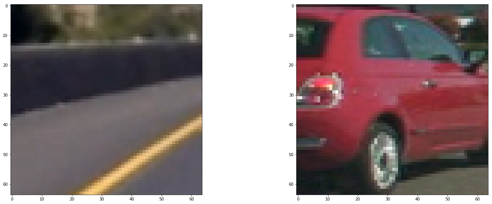
   
  <b>Sample Car, Non-Car Images</b>

I then explored different color spaces and different `skimage.hog()` parameters (`orientations`, `pixels_per_cell`, and `cells_per_block`).  I grabbed random images from each of the two classes and displayed them to get a feel for what the `skimage.hog()` output looks like.

Here is an example using the `LUV` color space and HOG parameters of `orientations=9`, `pixels_per_cell=(8, 8)` and `cells_per_block=(2, 2)`:

  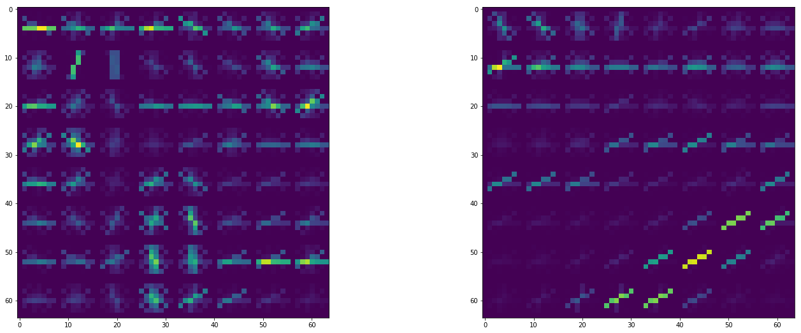
   
  <b>Sample Non-Car, Car Hog Conversion</b>

#### 2. Explain how you settled on your final choice of HOG parameters.

I tried a number of color spaces to begin with and spend sometime exploring how the images looked in the different color spaces and selected the `LUV` color space. Here are some of the hog combinations I tried,
1. orient 10, pix_per_cell = 16, cell_per_block = 2
1. orient 3, pix_per_cell = 8, cell_per_block = 2
1. orient 32, pix_per_cell = 8, cell_per_block = 2
1. orient 9, pix_per_cell = 8, cell_per_block = 4

The output results (in order) were;

  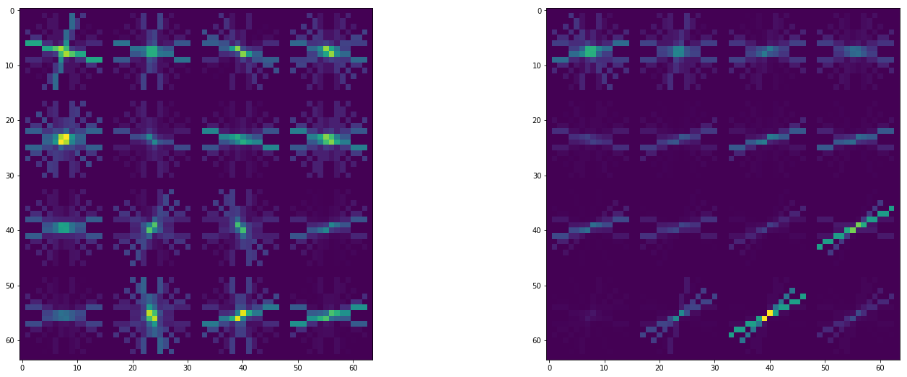
   
  <b>Hog Params 1</b>

  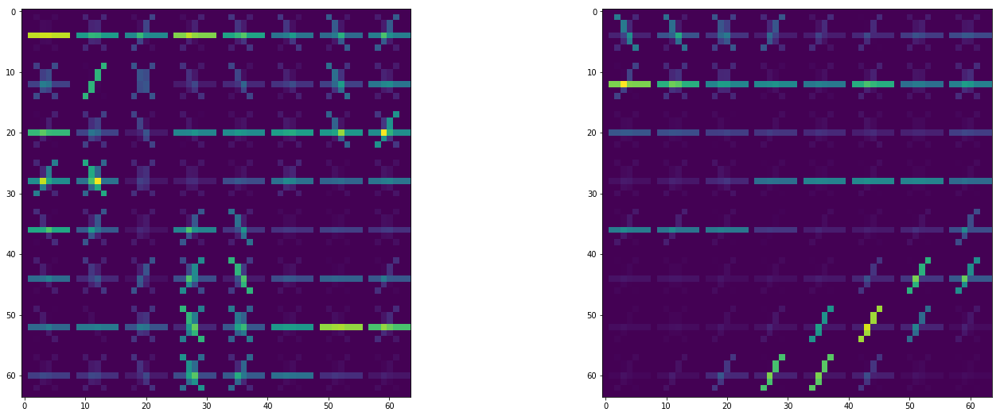
   
  <b>Hog Params 2</b>

  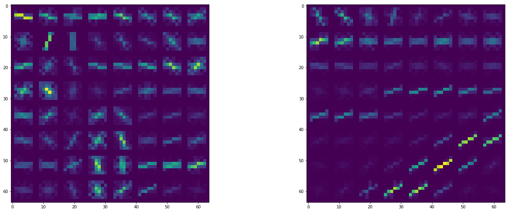
   
  <b>Hog Params 3</b>

  
   
  <b>Hog Params 4</b>

*Finally decided to stick to proposed one in the course*

#### 3. Describe how (and identify where in your code) you trained a classifier using your selected HOG features (and color features if you used them).

The code is in [Training.ipynb](Training.ipynb) in the sixth cell. The color space used was `LUV`, spatial binning with 16x16, color histogram for all channels in 32 bins, and finally the hog features for ALL channels. The final number of features was 6108. The features were normalized using a standard scaler. 

I used a Linear SVM with a train, test ratio of 8:2. 

The final accuracy reached was >99%. The model was saved for using in the pipeline. 

### Sliding Window Search

#### 1. Describe how (and identify where in your code) you implemented a sliding window search.  How did you decide what scales to search and how much to overlap windows?

  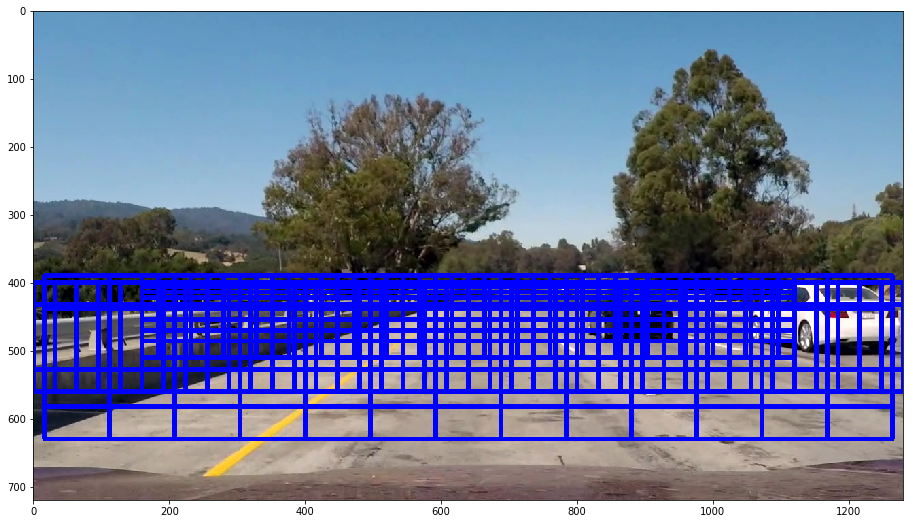
   
  <b>All Windows - 307 Total</b>

The code is in [Pipeline.ipynb](Pipeline.ipynb) file in the 3 and 4th cells. I took sample images from the project video with the cars in various positions. For each of this positions I tried to apporximate the cell boundaries. The final boundaries are available in cell 3 of the notebook. For the overlaps, I found through experimentation that the vertical overlap was giving better results that the horizontal ones. However, I feel there are still too many windows. There is also some empty window space towards the right. 

#### 2. Show some examples of test images to demonstrate how your pipeline is working.  What did you do to optimize the performance of your classifier?

No modification was made to the classifier. Here are some example images for the hot windows:

  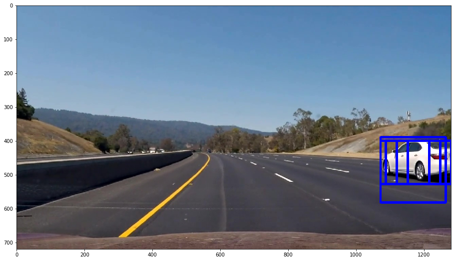
   

  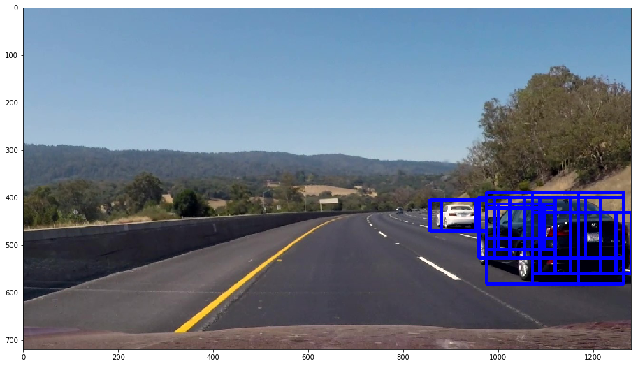
   

  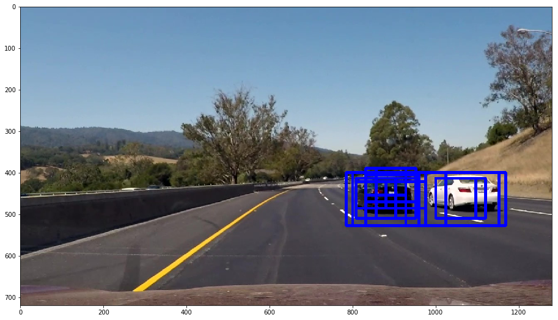
   

  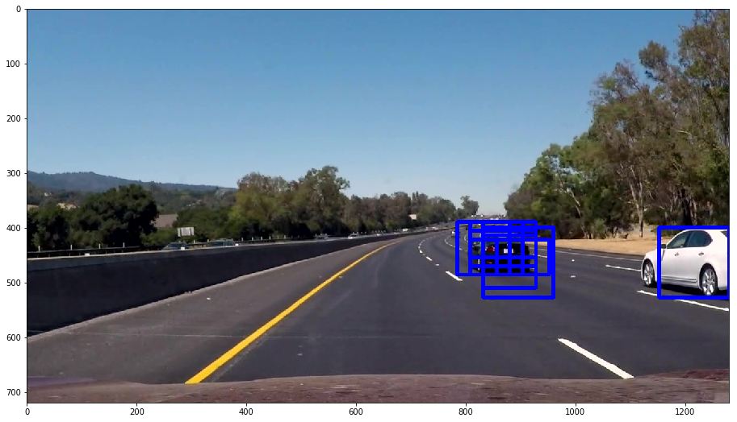
   

  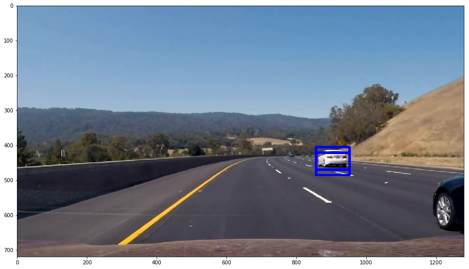
   

  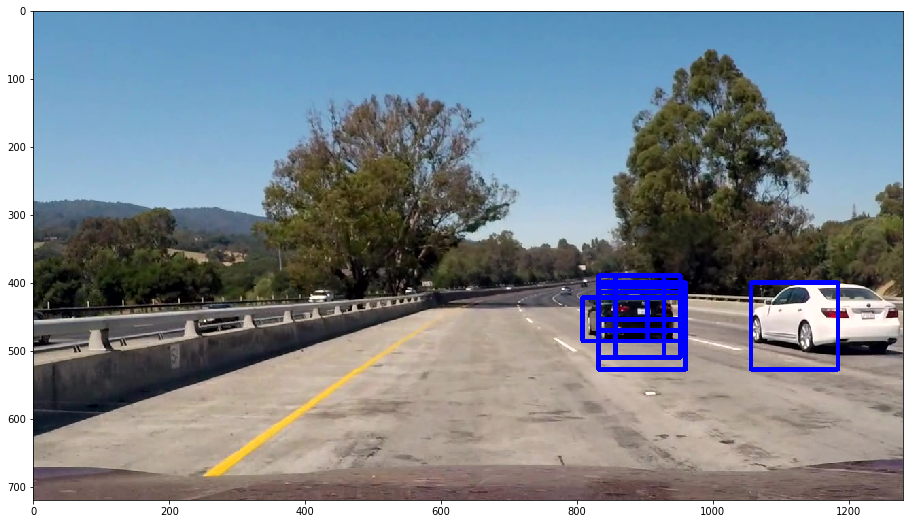
   
  <b>Detection using Classifier</b>

### Video Implementation

#### 1. Provide a link to your final video output.  Your pipeline should perform reasonably well on the entire project video (somewhat wobbly or unstable bounding boxes are ok as long as you are identifying the vehicles most of the time with minimal false positives.)
Here's a [link to my video result](./output.mp4)

#### 2. Describe how (and identify where in your code) you implemented some kind of filter for false positives and some method for combining overlapping bounding boxes.
The code is in [Pipeline.ipynb](Pipeline.ipynb) file in the 10th cell.

I recorded the positions of positive detections in each frame of the video.  From the positive detections I created a heatmap and then thresholded that map to identify vehicle positions.  I then used `scipy.ndimage.measurements.label()` to identify individual blobs in the heatmap.  I then assumed each blob corresponded to a vehicle.  I constructed bounding boxes to cover the area of each blob detected.  
Here's an example result showing the heatmap from a series of frames of video, the result of `scipy.ndimage.measurements.label()` and the bounding boxes then overlaid on the last frame of video:

### Here are six frames and their corresponding heatmaps. The red dots are the centroids:

  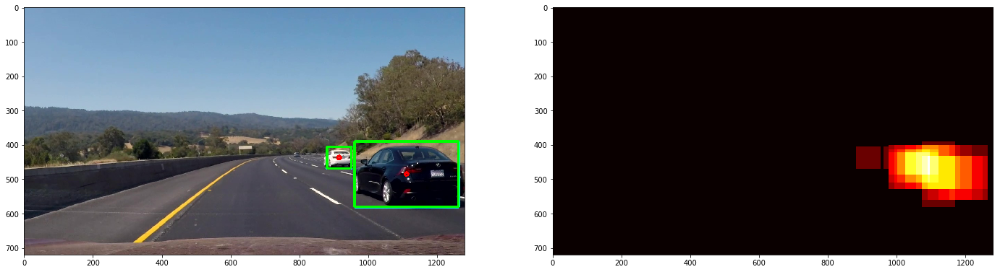
   

  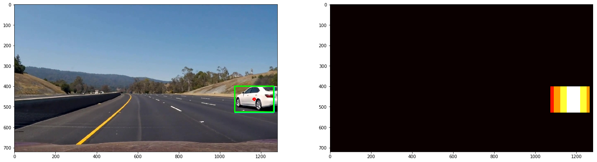
   

  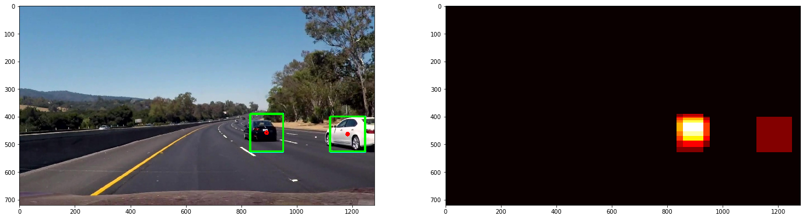
   

  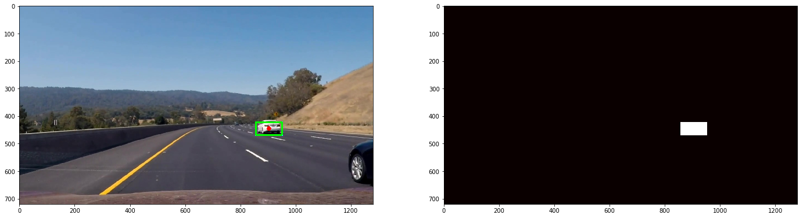
   

  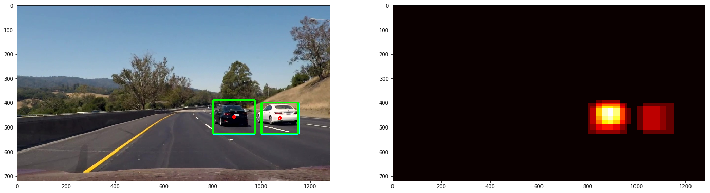
   
  <b>Images and Heatmap</b>

### Improving the video
The two issues that I was having was removing spurious detections and ensuring a reasonable bounding box for failed detections. I though of solving them by using a queue of detections in the `Object_Tracking` class. There is a `MIN_ENTRY_FRAMES = 5` which means that a bounding box must be present in atleast 5 consecutive frames for the system to identify that as a car. There is also a `MIN_EXIT_FRAMES = 10` which means that an already detected car will still be considered if the detection fails for 9 consecutive frames. 

The code is in [Pipeline.ipynb](Pipeline.ipynb) file in the 9th cell.

---

### Discussion

#### 1. Briefly discuss any problems / issues you faced in your implementation of this project.  Where will your pipeline likely fail?  What could you do to make it more robust?

1. In the initial stage I had just used the GTI dataset and not the KITTI one resulting in large number of spurious results which I found it difficult to address in the `Object_Tracking` pipeline. I lost a lot of time because of this. The KITTI database addition hugely improved performance. 
1. There needs to be pruning of centroids detected in the `Object_Tracking` class. You can see that sometimes the same car is detected twice because of this tracking class. This can be solved by ensuring that 2 bounding boxes with > X% overlap are merged. 
1. Performance of my algorithm needs to be improved. 307 windows is just too much. 
1. Bounding box stability needs to be improved as well. 

